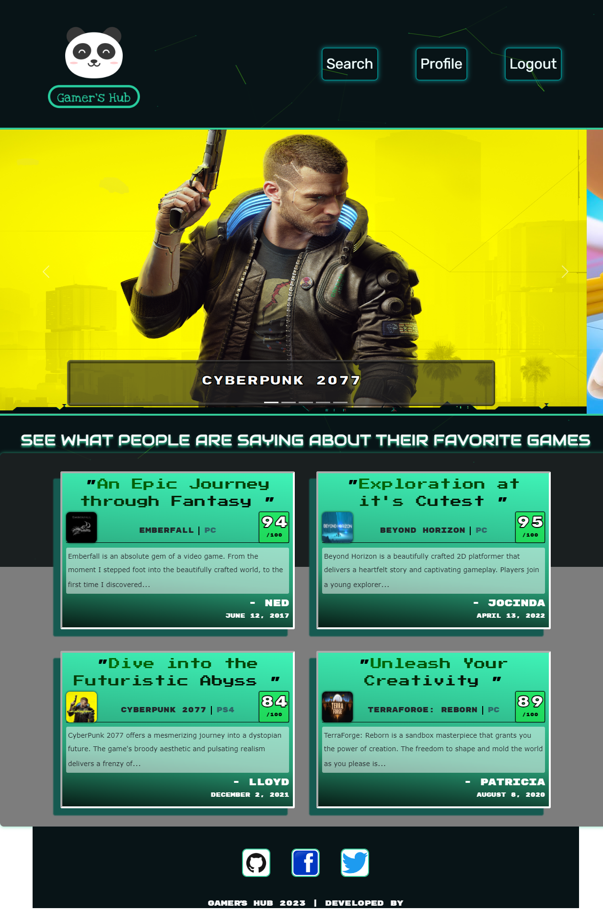
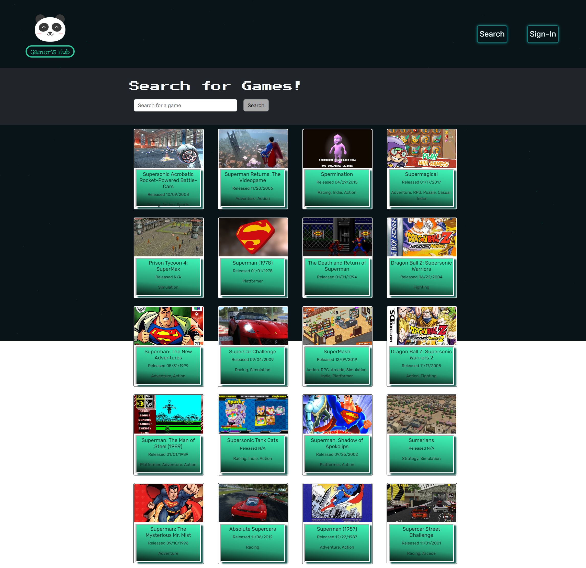
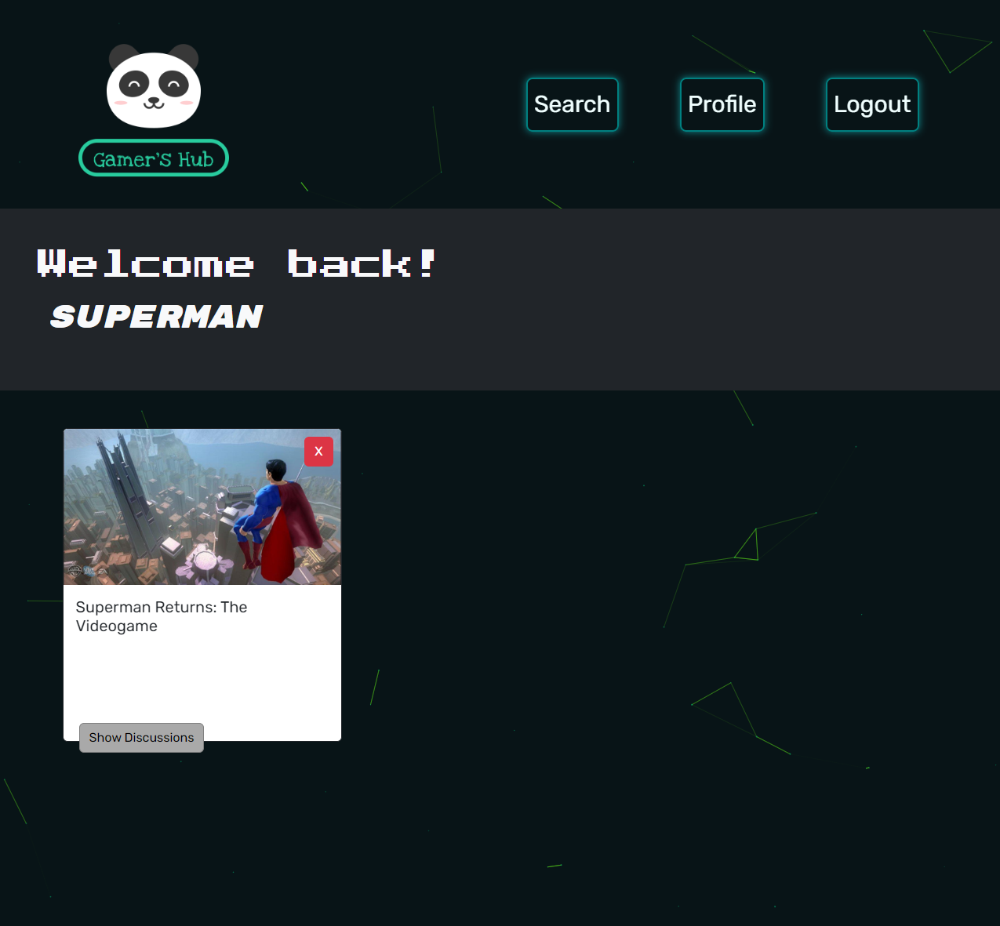
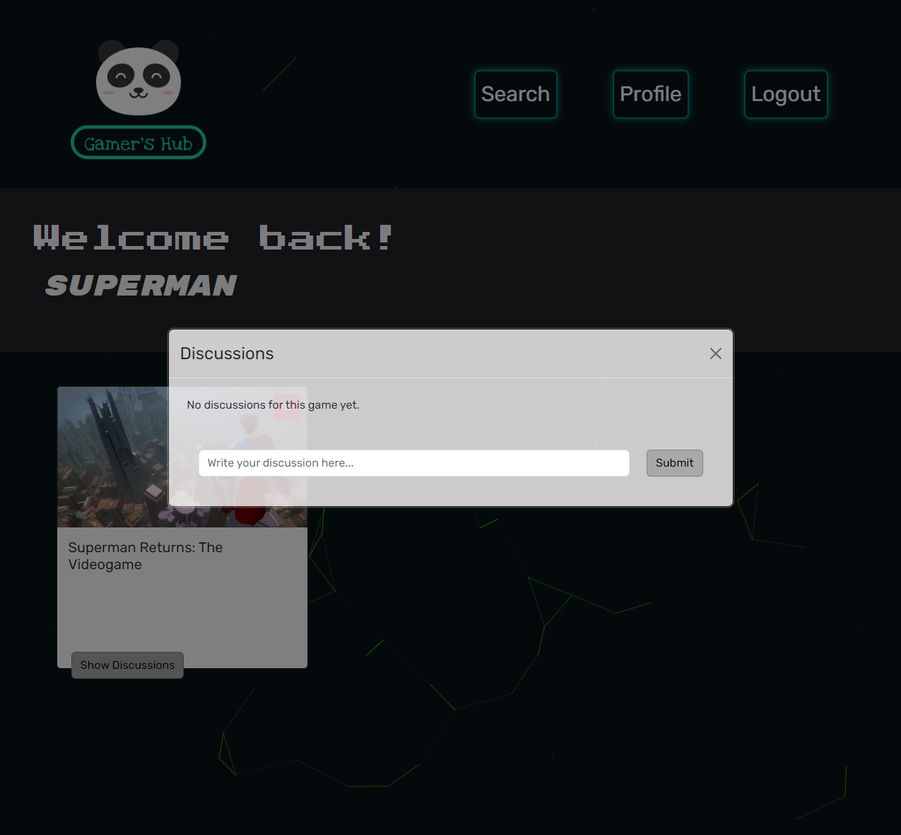
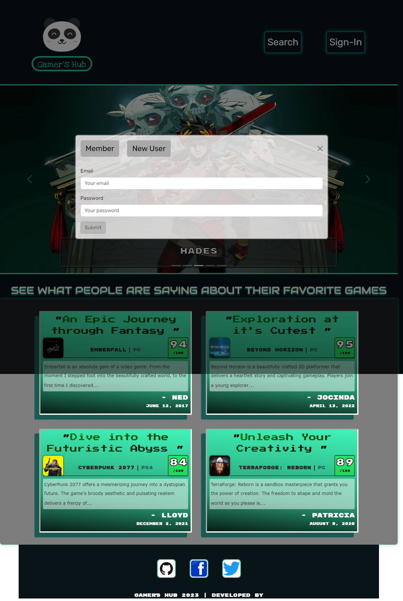

# Gamers-Hub
  

Find games from new, old, and featured titles. Search the database for specific game titles. Discuss your favorite games with the community!

## Description
* Uses React for the a more responsive and performance reliant website.
* Created using nodejs with apollo and graphql for queries and mutations.
* Uses MongoDB for the back-end server side to store data.
* Uses JWT for authentication for back-end and front-end.
* Users are able to fetch from the database for their favorite games.
* Users are able to create their own discussion to their favorite games.

## Table of Contents
- [Installation](#installation)
- [Usage](#usage)

- [Screenshot/Video](#screenshotvideo)
- [Deployed APP](#deployed-application)
- [Contributing](#contributing)
- [License](#license)
- [Questions](#questions)

## Installation
* _Run installation_:
> npm install

* _Run in terminal_:
> npm run build

* _Run in terminal_:
> npm run develop

## Usage
Usage of this application is to create a well responsive website with React for the client-side and use Apollo Sever/GraphQL for the server side with MongoDB/Mongoose. Users are able to fetch data from the client-side with queries and mutations and are able retrieve their data from MonoDB.

## Screenshot/Video

## Deployed Application
*A list of links of deployed applications:*

- [The-Gamers-Hub](https://the-gamers-hub-145e411c6374.herokuapp.com/)

## Contributing
*A list of contributors on this project includes:*

* [Sith Hun](https://github.com/SithHun)
* [Benjamin Bryant](https://github.com/benbryant98)
* [Nina Sandler](https://github.com/antigravityrunner)
* [Massar Sow](https://github.com/Yerim17)

*Third-party applications used to create this project:*
* [webfontloader](#)
* [bootstrap](#)
* [apollo-client](#)
* [graphQL](#)
* [jwt-decode](#)
* [react](#)
* [react-bootstrap](#)
* [react-dom](#)
* [react-particles](#)
* [react-router-dom](#)
* [react-scripts](#)
* [styled-components](#)
* [tsparticles-slim](#)
* [inquirer](#)
* [MongoDB](#)
* [Mongoose](#)
* [NodeJS](#)
* [ExpressJS](#)

## License
*This project is licensed under the MIT.*

## Questions
If you have any questions, you can reach out to me via GitHub: 

[@SithHun](https://github.com/SithHun)

[@Benjamin Bryant](https://github.com/benbryant98)

[@Nina Sandler](https://github.com/antigravityrunner)

[@Massar Sow](https://github.com/Yerim17)

Feel free to contact me via email: 

sithsun@gmail.com

bryantbc98@gmail.com

ninasandler33@gmail.com

Yerimsw@gmail.com

 

> *Credits: This ReadMe was created with ❤️ by [Professional-ReadMe-Generator](https://github.com/SithHun/Professional-ReadMe-Generator)*
